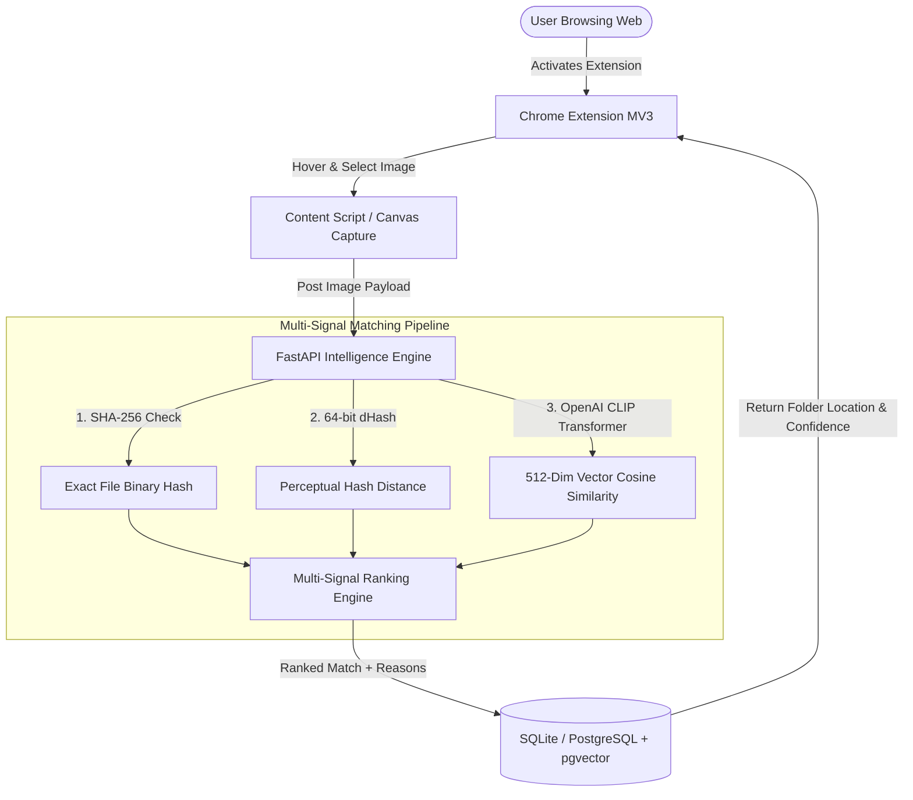

# FolderLens AI — Visual File Intelligence Platform

**FolderLens** is a complete, production-grade AI visual file search platform. It allows users to upload and organize image assets into folders in a web application, and activate a Chrome extension while browsing the web. When an image is selected on any webpage, FolderLens searches the user's personal indexed library, identifies the exact file and folder where it is stored, and displays multi-signal match confidence explanations.

---

## 🏗️ System Architecture



---

## ✨ Features

- **Multi-Signal Image Intelligence**:
  - **SHA-256 Hash**: Instant 100% exact duplicate file recognition.
  - **Difference Hash (dHash)**: Perceptual 64-bit fingerprint matching for resized, compressed, or cropped variants.
  - **OpenAI CLIP Embeddings**: 512-dimensional semantic visual feature vectors.
- **Linear & Raycast Inspired UI**: Dark mode glassmorphism dashboard (`#080C14`, `#0B0F17`), glows, and typography.
- **Command Palette (`Ctrl + K`)**: Instant keyboard navigation across folders, library search, duplicates, and settings.
- **Duplicate Intelligence**: Automatic identification of exact and near-duplicate files with storage savings calculator.
- **AI Natural Language Assistant**: Text-to-image semantic query vector search ("Find all red shoes", "Show chargers").
- **Chrome Extension (Manifest V3)**: Side panel API integration, webpage hover outline, drag box selector, and right-click context menu ("Search with FolderLens AI").
- **Library Analytics**: Real-time stats on total files, storage space, folder breakdown, and format distribution.

---

## 🛠️ Tech Stack

- **Backend**: Python 3.13, FastAPI, PyTorch, HuggingFace Transformers, OpenAI CLIP (`openai/clip-vit-base-patch32`), Pillow, NumPy, SQLAlchemy.
- **Web App**: React 18, TypeScript, Vite, Tailwind CSS (Custom Dark Theme), Lucide Icons.
- **Database**: SQLite (local dev fallback) or PostgreSQL + `pgvector`.
- **Extension**: Chrome Extension Manifest V3, Side Panel API, Content Script image selector.

---

## 🚀 Quick Start Guide

### 1. Backend Setup

```bash
# Navigate to backend directory
cd backend

# Create Python virtual environment
python -m venv venv

# Activate virtual environment
# Windows:
venv\Scripts\activate
# Linux/macOS:
source venv/bin/activate

# Install dependencies
pip install -r requirements.txt

# Start FastAPI server
python -m uvicorn app.main:app --reload --host 0.0.0.0 --port 8000
```
Backend API interactive docs will be available at `http://localhost:8000/docs`.

### 2. Web App Setup

```bash
# Navigate to admin-web directory
cd admin-web

# Install dependencies
npm install

# Start Vite dev server
npm run dev
```
Web App will open at `http://localhost:5173`.

### 3. Chrome Extension Setup

```bash
# Navigate to extension directory
cd extension

# Install dependencies
npm install

# Build production bundle
npm run build
```
This generates the unpacked Chrome extension in `extension/dist`.

#### Loading into Chrome:
1. Open Google Chrome and go to `chrome://extensions`.
2. Enable **Developer mode** (top-right toggle).
3. Click **Load unpacked** (top-left button).
4. Select the `extension/dist` folder.

---

## 📡 Key API Endpoints

| Method | Endpoint | Description |
|---|---|---|
| `POST` | `/api/search/image` | Multi-signal visual image search (SHA-256 + dHash + CLIP) |
| `POST` | `/api/products` | Upload image file, generate vector & hashes, index product |
| `GET` | `/api/folders` | List image library folders |
| `GET` | `/api/intelligence/duplicates` | Scan library for exact & near-duplicate files |
| `GET` | `/api/intelligence/analytics` | Retrieve library storage & file distribution metrics |
| `POST` | `/api/intelligence/assistant` | Natural language text-to-image semantic search |
| `GET` | `/api/auth/demo` | Zero-config portfolio demo login |

---

## 📜 Portfolio Presentation & Architecture

Access the in-app **Architecture Overview** modal by pressing `Ctrl + K` inside the Web App or clicking the **Architecture** button in the navigation header to inspect the complete problem/solution statement and technical matching pipeline.
